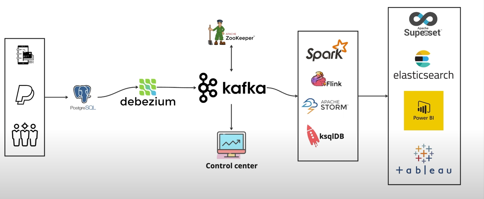

# CDC with Debezium, Kafka, Postgres and Docker

## Overview

This Python script is designed to generate simulated financial transactions and insert them into a PostgreSQL database. It's particularly useful for setting up a test environment for Change Data Capture (CDC) with Debezium. The script uses the `faker` library to create realistic, yet fictitious, transaction data and inserts it into a PostgreSQL table.

## System Architecture


## Prerequisites

Before running this script, ensure you have the following installed:
- Python 3.9+
- `psycopg2` library for Python
- `faker` library for Python
- PostgreSQL server running locally or accessible remotely
- Docker and Docker Compose installed on your machine.
- Basic understanding of Docker, Kafka, and Postgres.

## Installation

1. **Install Required Python Libraries:**

   You can install the required libraries using pip:

   ```bash
   pip install psycopg2-binary faker
   ```

## Services in the Compose File

- **Zookeeper:** A centralized service for maintaining configuration information, naming, providing distributed synchronization, and providing group services.
- **Kafka Broker:** A distributed streaming platform that is used here for handling real-time data feeds.
- **Confluent Control Center:** A web-based tool for managing and monitoring Apache Kafka.
- **Debezium:** An open-source distributed platform for change data capture.
- **Debezium UI:** A user interface for managing and monitoring Debezium connectors.
- **Postgres:** An open-source relational database management system (RDBMS).

## Getting Started

1. **Clone the Repository:**
   Ensure you have this Docker Compose file in your local system. If it's part of a repository, clone the repository to your local machine.

2. **Navigate to the Directory:**
   Open a terminal and navigate to the directory containing the Docker Compose file.

3. **Run Docker Compose:**
   Execute the following command to start all services defined in the Docker Compose file:

   ```bash
   docker-compose up -d
   ```

   This command will download the necessary Docker images, create containers, and start the services in detached mode.

4. **Verify the Services:**
   Check if all the services are up and running:

   ```bash
   docker-compose ps
   ```

   You should see all services listed as 'running'.

5. **Accessing the Services:**
   - Kafka Control Center is accessible at `http://localhost:9021`.
   - Debezium UI is accessible at `http://localhost:8080`.
   - Postgres is accessible on the default port `5432`.

6. **Shutting Down:**
   To stop and remove the containers, networks, and volumes, run:

   ```bash
   docker-compose down
   ```

## Customization
You can modify the Docker Compose file to suit your needs. For example, you might want to persist data in Postgres by adding a volume for the Postgres service.

## Note
This setup is intended for development and testing purposes. For production environments, consider additional factors like security, scalability, and data persistence.